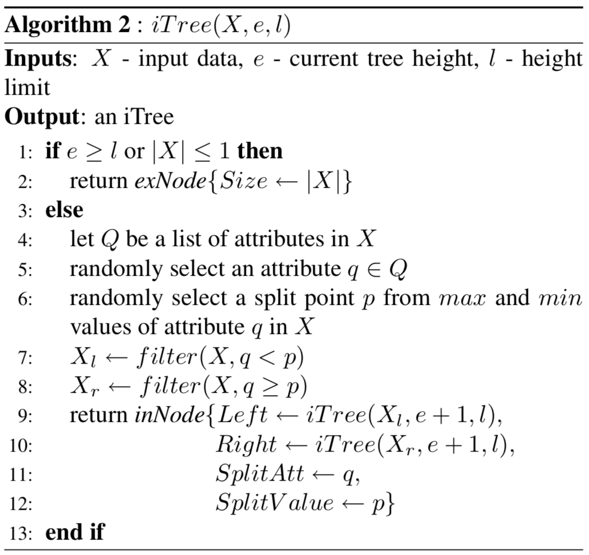

# Isolation Forest Algorithm from Scratch

*Original paper: https://cs.nju.edu.cn/zhouzh/zhouzh.files/publication/icdm08b.pdf*

This is the course project of MSDS689 - Data Structure and Algorithms, designed by Professor Terence Parr. The goal of this project is to implement the original Isolation Forest algorithm by Fei Tony Liu, Kai Ming Ting, and Zhi-Hua Zhou (link is shown above) from scratch to better understand this commonly implemented approach for anomaly detection.  

This algorithm is based on the idea that in most cases the anomaly points are few and different. With enough many times of random splits, we can isolate the anomaly points efficiently.  

## Dataset  

Below is one of the data sets I used to test the algorithm:  
+ [Kaggle credit card fraud competition data set](https://www.kaggle.com/mlg-ulb/creditcardfraud)  

## Algorithm

According to the Liu et al paper, the algorithms of an isolation forest are as follow:  

<table border="0">
<tr>
<td width="50%" valign="top"></td><td width="50%" valign="top"></td>
</tr>
<tr>
<td valign="top">

</td>
<td valign="top">
Average path length <tt>c()</tt>:<br>


<p>Then finally here's the scoring formula:<br>


<p>where "<i>H(i)</i> is the harmonic number and it can be estimated by <i>ln(i)</i> + 0.5772156649 (Euler’s constant)."
</td>
</tr>
</table>

## Code Structure  

The basic idea of this algorithm is that anaomaly points tend to appear in the shallow part of the tree due to their differences from normal points. So by calculating the average path length of each node in every tree, we can thus compute an anomaly score based on the path length and figure out which points are more likely to be anomaly points. The result also depends on the score threshold we set.  

```
|-- class externalNode  
    |-- __init__(self, size, current_tree_height)  
|-- class internalNode  
    |-- __init__(self, left, right, splitAttr, splitValue, current_tree_height)  
|-- class IsolationTree  
    |-- __init__(self, current_height, height_limit, n_nodes=0)  
    |-- fit(self, X: np.ndarray, improved=False)  
    |-- make_split(self, X, improved)  
    |-- create_child(self, X, current_height, improved)  
|-- IsolationTreeEnsemble  
    |-- __init__(self, sample_size, n_trees=10)  
    |-- fit(self, X: np.ndarray, improved=False)  
    |-- avg_path_length(self, subsample_size)  
    |-- tree_path_length(self, x, tree)  
    |-- path_length(self, X: np.ndarray)  
    |-- anomaly_score(self, X: np.ndarray)  
    |-- predict_from_anomaly_scores(self, scores: np.ndarray, threshold: float)
|-- find_TPR_threshold(y, scores, desired_TPR)
```

## To make the algorithm more robust...  

One of the known weakenesses of this original Isolation Forest algorithm is that it cannot well handle lots of irrelevant or noisy features. We can test it by adding some white noise columns to the data set (use `-noise` when executing the script).  

To improve the algorithm and make it more robust while maintaining the speed of the algorithm, for each split, we randomly pick three columns instead of only one column, split them randomly, and then pick the "best" split among the three for the current node. To define a "good" split, the further the split is away from the column mean, the better we think this split is. In this way, the probability of always using the noisy features is very low so the influence of having noisy features will be reduced.  
